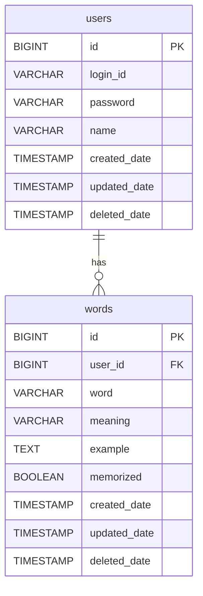

# ER Diagram

```mermaid
erDiagram
    users {
        BIGINT id PK
        VARCHAR login_id
        VARCHAR password
        VARCHAR name
        TIMESTAMP created_date
        TIMESTAMP updated_date
        TIMESTAMP deleted_date
    }

    words {
        BIGINT id PK
        BIGINT user_id FK
        VARCHAR word
        VARCHAR meaning
        TEXT example
        BOOLEAN memorized
        TIMESTAMP created_date
        TIMESTAMP updated_date
        TIMESTAMP deleted_date
    }

    users ||--o{ words : has

```
