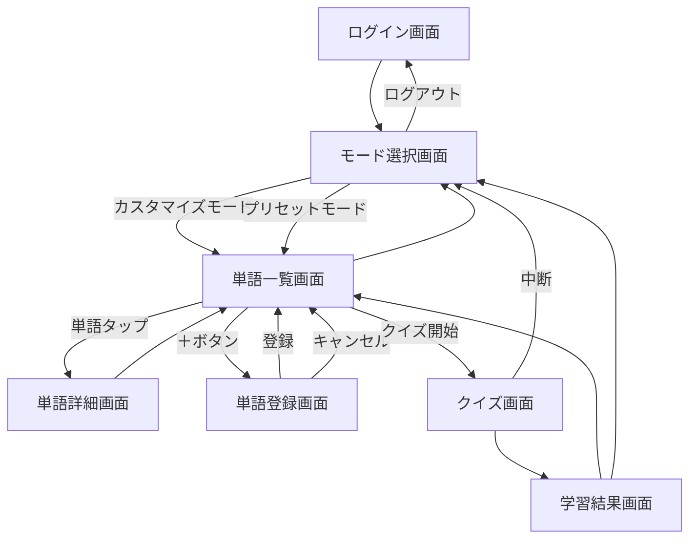

# 英単語アプリ 画面遷移図

## 画面一覧

* ログイン画面
* モード選択画面(カスタマイズ/プリセット)
* 単語一覧
* 単語登録(カスタマイズモード)
* 単語詳細
* クイズ画面
* 学習結果画面

```mermaid
graph TD
    ログイン画面 --> モード選択画面
    モード選択画面 -- ログアウト --> ログイン画面
    モード選択画面 -- カスタマイズモード --> 単語一覧画面
    モード選択画面 -- プリセットモード --> 単語一覧画面

    単語一覧画面 -- 単語タップ --> 単語詳細画面
    単語詳細画面 --> 単語一覧画面
    単語一覧画面 -- ＋ボタン --> 単語登録画面
    単語登録画面 -- 登録 --> 単語一覧画面
    単語登録画面 -- キャンセル --> 単語一覧画面
    単語一覧画面 -- クイズ開始 --> クイズ画面
    単語一覧画面 --> モード選択画面

    クイズ画面 -- 中断 --> モード選択画面
    クイズ画面 --> 学習結果画面

    学習結果画面 --> 単語一覧画面
    学習結果画面 --> モード選択画面
```

