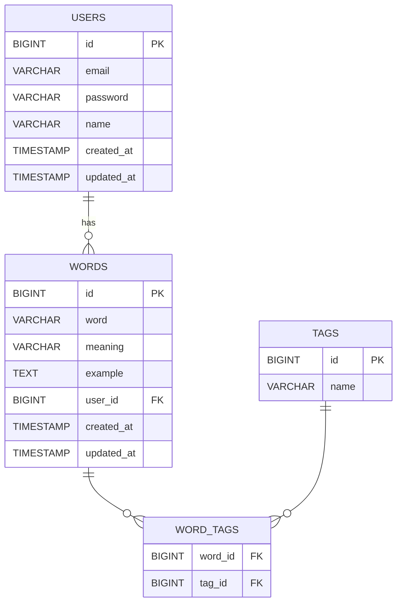

# ER Diagram

```mermaid
erDiagram
    USERS {
        BIGINT id PK
        VARCHAR email
        VARCHAR password
        VARCHAR name
        TIMESTAMP created_at
        TIMESTAMP updated_at
    }

    WORDS {
        BIGINT id PK
        VARCHAR word
        VARCHAR meaning
        TEXT example
        BIGINT user_id FK
        TIMESTAMP created_at
        TIMESTAMP updated_at
    }

    TAGS {
        BIGINT id PK
        VARCHAR name
    }

    WORD_TAGS {
        BIGINT word_id FK
        BIGINT tag_id FK
    }

    USERS ||--o{ WORDS : "has"
    WORDS ||--o{ WORD_TAGS : ""
    TAGS ||--o{ WORD_TAGS : ""
```
