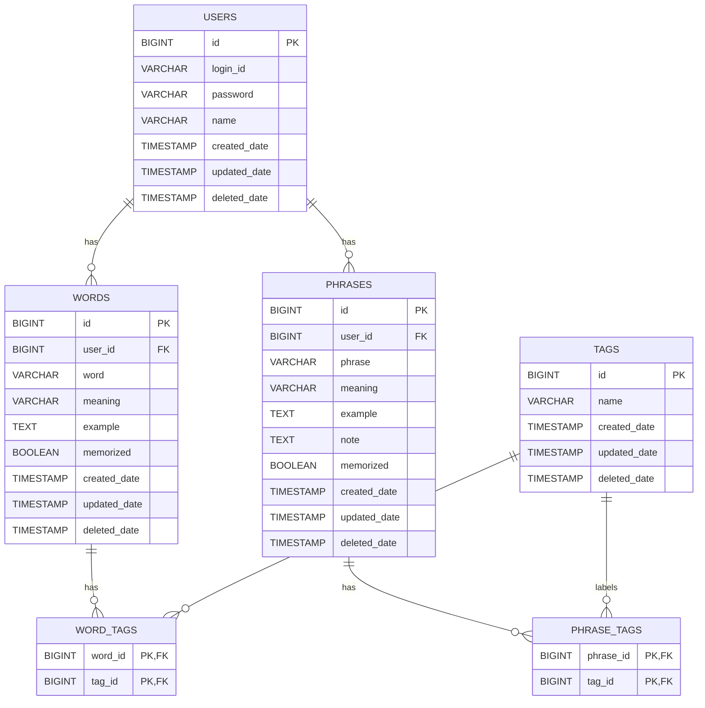

# ER Diagram

```mermaid
erDiagram
    USERS {
        BIGINT id PK
        VARCHAR login_id
        VARCHAR password
        VARCHAR name
        TIMESTAMP created_date
        TIMESTAMP updated_date
        TIMESTAMP deleted_date
    }

    WORDS {
        BIGINT id PK
        BIGINT user_id FK
        VARCHAR word
        VARCHAR meaning
        TEXT example
        BOOLEAN memorized
        TIMESTAMP created_date
        TIMESTAMP updated_date
        TIMESTAMP deleted_date
    }
    
    PHRASES {
        BIGINT id PK
        BIGINT user_id FK
        VARCHAR phrase
        VARCHAR meaning
        TEXT example
        TEXT note
        BOOLEAN memorized
        TIMESTAMP created_date
        TIMESTAMP updated_date
        TIMESTAMP deleted_date
    }

    TAGS {
        BIGINT id PK
        VARCHAR name
        TIMESTAMP created_date
        TIMESTAMP updated_date
        TIMESTAMP deleted_date
    }

    WORD_TAGS {
        BIGINT word_id PK, FK
        BIGINT tag_id PK, FK
    }
    
    PHRASE_TAGS {
        BIGINT phrase_id PK, FK
        BIGINT tag_id PK, FK
    }

    USERS ||--o{ WORDS : has
    USERS ||--o{ PHRASES : has

    WORDS ||--o{ WORD_TAGS : has
    TAGS  ||--o{ WORD_TAGS : labels

    PHRASES ||--o{ PHRASE_TAGS : has
    TAGS    ||--o{ PHRASE_TAGS : labels
```
